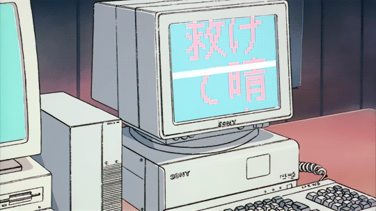

# Проект по автоматизированному тестированию
<p align="center">

</p>

## Содержание:
- <a href="#description">Описание</a>
- <a href="#технологии-и-инструменты">Технологии и инструменты</a>
- <a href="#gradle-launch">Запуск проекта из терминала</a>
- <a href="#jenkins-launch">Запуск проекта из Jenkins</a>
- <a href="#notebook_with_decorative_cover-реализованные-проверки">Реализованные проверки</a>
- [Отчеты](#-отчеты)
- - [Allure](#-allure)
- - [Allure TestOps](#-allure-testops)
- - [Telegram](#-telegram)
- <a href="#видеозапись-тестов">Видеозапись тестов</a>

## <a name="description">Описание</a>
Данный проект является многомодульным и содержит автоматизированные тесты UI, API и Mobile. Сборка -  Gradle. CI/CD - Jenkins

## Технологии и инструменты
<p align="center">


<a href="https://qameta.io/"></a>
<a href="https://appium.io/"></a>
<a href="https://www.browserstack.com/"></a>
</p>

<a id="gradle-launch"></a>
## :computer: Запуск проекта из терминала

Запуск UI тестов:
```bash
gradle clean ui_test -Dbrowser.name=<name> -Dbrowser.size=<size>
```
Запуск API тестов:
```bash
gradle clean api_test
```
Запуск Mobile тестов на локальном эмуляторе:
```bash
gradle clean mobile_test -Denv=local -DdeviceHost=emulation
```
Запуск Mobile тестов в browserstack:
```bash
gradle clean mobile_test -Denv=remote -DdeviceHost=browserstack 
```

В зависимости от выбранных env и deviceHost, будет использоваться определенный property файл


## <a id="jenkins-launch"></a> <a href=https://jenkins.autotests.cloud/job/HomeworkQaGuru/>Запуск проекта из Jenkins</a>


Параметризованная сборка проекта

<a href="https://jenkins.autotests.cloud/job/HomeworkQaGuru/build?delay=0sec">
</a>

Параметры сборки:
>- *`tag` - выбор вида тестов*
>- *`platform` - платформа*
>- *`env` - окружение, на котором будут выполнятся тесты*
>- *`browser` - браузер*
>- *`REMOTE_URL` - адрес Selenoid*
>- *`VIDEO_STORAGE` - адрес хранилища видео Selenoid*

```bash
gradle clean ...
```
## Отчеты о прохождении тестов

<a id="allure"></a>
## <a href="https://jenkins.autotests.cloud/job/HomeworkQaGuru/allure/"> Allure</a>

Пример Allure отчёта


<a id="allure-testops"></a>
## <a href="https://allure.autotests.cloud/project/1687/dashboards"> Allure TestOps</a>

Пример Allure TestOps отчёта

 

<a id="telegram"></a>
## <a href="https://t.me/qaGguruHw_14_edemID_bot"> Telegram</a>

Пример уведомления в Telegram-бот по окончании выполнения тестов


## Видеозапись тестов
<a id="selenoid"></a>
##  Selenoid</a>

Видеозапись UI-теста в Selenoid

<p align="center">
  
</p>

<a id="browserstack"></a>
##  Browserstack</a>

Видеозапись Mobile-теста в Browserstack

<video src="https://user-images.githubusercontent.com/110110734/202863081-112a3796-fd9d-40ce-9684-392458f28ee8.mp4"
controls="controls" style="max-width: 730px;" poster="/external/logos/Browserstack.svg"></video>


:heart:
:blue_heart: 
